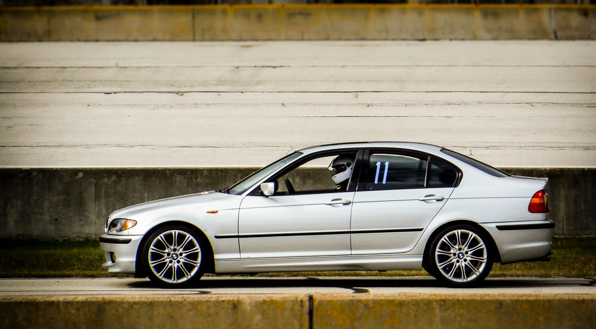

# Gem of a 2004 330 ZHP 6-speed Sedan

Mileage: 177,000 (original owner)

Location: Seattle, WA (Lake Forest Park)

Owner contact:
Please contact the owner via [this Craigslist posting](https://seattle.craigslist.org/see/cto/d/seattle-2004-bmw-330-zhp/7235581986.html)

Price: The asking price is $8000 or best offer, and I understand this is quite a high number, yet knowing what I know about the car and appreciating the car's amazing handling as I do, I would gladly cough up that much myself to acquire it. However, I do need a fast sale, so the buyer has lots of leverage here. Furthermore, "best offer" does not necessarily mean highest number -- I would love to see this car go to someone who will appreciate it as much as it deserves.

This image was blatantly copied from [Rev's Garage](https://revsgarage.wordpress.com/2018/05/16/average-joe-car-review-e46-330i-zhp/) until I can wash my own car to photograph it.

Sticker Options:
* 6-Speed Manual Transmission
* Titanium Silver
* Black Leather
* Cold Weather Package
* Performance Package (ZHP)
* Glass Moonroof
* Rain Sensor
* Xenon Headlights
* Harman-Kardon Sound System

Aftermarket Options:
* OS Giken LSD with 3.46 diff ratio
* TC Kline double-adjustable coil-overs
* TC Kline camber kit (modified as described below)
* H&R rear sway bar
* Welded sway bar mount reinforcement kit
* Powerflex bushings everywhere
* ZKW headlight metal projectors
* BSW speaker kit
* That cool European driver wing mirror glass (no blind spot)
* Hawk HPS pads all around
* Schroth 4-point harnesses
* Alarm system is installed, but never got dealer-activated
* Stewart water pump

## Why for heaven's sake would anyone sell this car?

I bought this car new and planned to drive it until one of us went wheels up. Fate intervened in the form of a wonderful woman who has invited me to live with her on Maui, and Maui, as it turns out, is inhospitable to sports sedans. There's really no place to drive them like they deserve, and the driveway to my new island home would high-center my beloved car by 2 inches.

## Bumps, bruises, and caveats
* As is common for this engine type, it burns about a quart of oil per 630 miles
* Minor curb rash on all wheels
* Hood could use repainting; there are numerous small rock chips, plus a half-dollar sized spot of damage by weirdly corrosive bird poop.
* The moonroof worked last time I used it and has never given me any problems, but I pulled the fuse a couple of years ago because I never used it and didn't want it to stick open if it ever failed.
* It needs to be taken in for the passenger airbag recall.
* Windshield has a small chip that doesn't spread
* It has been about two years since the last coolant flush, so it's time for that.
* It's filthy because I'm too busy trying to sell my house (and this car) to get it washed.
* That cool Alcantara steering wheel that felt so good has been replaced by a boring leather one

## Beauty marks
* The Alcantara steering wheel that so quickly got disgusting has been replaced by a nice durable leather one
* Religiously maintained per Mike Miller's Old School Maintenance Schedule (with oil changes every 7500 miles)
* Always garaged, so the interior is in great shape
* No bent sheet metal
* Driver seatbelt is recently replaced
* All suspension joints are just a few years old except the steering rack parts, which are original
* The ground wire fix for the tail light assemblies has been done
* That deeply buried crankcase ventilation gadget has been recently replaced with a fresh unit
* E46 stock Xenon lights have plastic projector lenses that eventually darken so badly that you no longer have headlights. This car's have been modified to uses aftermarket metal projector lenses that never deteriorate.
* New headlight lens covers

## Junk in the trunk
Stuff that goes with the car includes:
* Snow wheels mounted with 1000-mile old Blizzaks. With these and the LSD you'll be very pleased with how this car is on snow and ice.
* Foxwell NT-510 multi-system scanner
* Snell 2015 HJC Motorsports helmet, never used
* Many odd little tools that are needed for E46 maintenance
* The stock suspension parts in case the TCK struts or shocks ever need to be rebuilt

## Notes about the TC Kline suspension
TC Kline DA suspensions are great on the track, but they have a couple of potential drawbacks. One is that some rear shocks of this type, being racing shocks, will make a clicking noise. Not a problem on the track, but not what you want in your daily driver. Fortunately, TC was good enough to work with me to find a quiet pair, and it seems if they don't start making noise in the first few hundred miles then they stay quiet. These have stayed quiet.

The other potential problem with the TC Kline setup is that the camber plates rely on a heavily loaded ball joint to allow for steering rotation. This joint can stop rotating after a time, and then the steering rotation causes a very noticeable "tink-tink-tink" noise as the bottom of the spring mount rotates and the top doesn't, causing the spring to stick and slip. I got tired of this and modifed the TCK camber plate by having a new part fabricated to replace the caster adjustment with a nice heavy tapered roller bearing. This modifed plate no longer has caster ajustment; the caster is set at max positive for best steering feel. It is now blissfully quiet.

## Maintenance notes
I'm afraid some of these numbers are estimates because I'm too crushed for time to check against the receipts. The Inspection 1 at about 151,000 was performed by me, but not properly recorded due to personal exigincies.

The car was only driven about 2000 miles between now (12/1/2020) and a year ago due to my time spent in Maui. Otherwise the car has accumulated about 10,000 - 12,000 miles per year for the past several years

* Oil and filter have been done per the dash display, and they get changed at the tracked interval (about 15,000) and the tracked interval plus 7,500. Today (12/1/2020) the service indicator reads 10050, so it's been about 5000 since last oil and filter, and I'd do the next change in 2500 mile from now. The Junk In The Trunk includes 2 filters, 10 quarts of oil, and one of those vacuum oil changers so you won't need filters right away.
* Air filter was done about 2 years ago.
* Brake fluid 154,312 miles 12 Jun 2017.
* Belts and pulleys about 3 years ago.
* Cabin air filter was this time last year, so it's fresh.
* Transmission fluid 154,312 miles 12 Jun 2017
* Power steering fluid 154,312 miles 12 Jun 2017
* Differential fluid 154,312 miles 12 Jun 2017. **IMPORTANT!!** THe diff must ONLY use the OS Giken fluid, [which can be ordered here](https://osgikenusa.com/products/os011-ka1) and no where else. Make a note of this web site location, because it's confusingly among the hats and shirts.
* Coolant about 151,000 miles
* Fuel filter about 4 years ago
* Cooling tank about 151,000
* Hoses, thermostat and coolant about 151,000. As a repair, the temperature sender has been RTV'd into the lower coolant hose, so when it's time to replace either you'll need to replace both. The o-ring on that sender tends to shrink and fail (it's happened to me twice, but it's a slow leak rather than a roadside disaster), so I'd suggest RTVing it in when you do change it and just treat the two things as a unit.
* Water pump 124,205 20 Oct 2013
* Valve cover gasket 154,312 miles 12 Jun 2017
* Oil filler housing gasket 124,205 20 Oct 2013
* CCV about 3 or 4 years ago
* Disa valve about 3 years ago